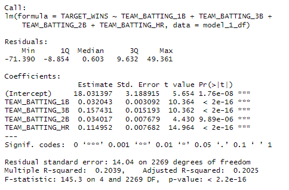
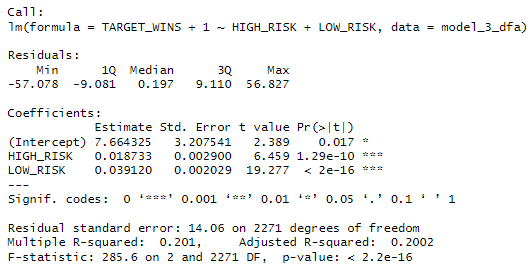

```{r setup, include=FALSE}
knitr::opts_chunk$set(echo = TRUE)
library(dplyr)
library(ggplot2)
library(mice)
library(GGally)
library(moments)
library(tidyr)
library(MASS)

```

## Overview 
In this homework assignment, you will explore, analyze and model a data set containing approximately 2200 records. Each record represents a professional baseball team from the years 1871 to 2006 inclusive. Each record has the performance of the team for the given year, with all of the statistics adjusted to match the performance of a 162 game season. 

Your objective is to build a multiple linear regression model on the training data to predict the number of wins for the team. You can only use the variables given to you (or variables that you derive from the variables provided). Below is a short description of the variables of interest in the data set:


## Deliverables:
- A write-up submitted in PDF format. Your write-up should have four sections. Each one is described below. You may assume you are addressing me as a fellow data scientist, so do not need to shy away from technical details.
- Assigned predictions (the number of wins for the team) for the evaluation data set.
- Include your R statistical programming code in an Appendix.

## Write Up INSTRUCTIONS:
#### 1) DATA EXPLORATION
Describe the size and the variables in the moneyball training data set. Consider that too much detail will cause a manager to lose interest while too little detail will make the manager consider that you aren’t doing your job. Some suggestions are given below. Please do NOT treat this as a check list of things to do to complete the assignment. You should have your own thoughts on what to tell the boss. These are just ideas.
a. Mean / Standard Deviation / Median
b. Bar Chart or Box Plot of the data
c. Is the data correlated to the target variable (or to other variables?)
d. Are any of the variables missing and need to be imputed “fixed”?

#### 2) DATA PREPARATION 
Describe how you have transformed the data by changing the original variables or creating new variables. If you did transform the data or create new variables, discuss why you did this. Here are some possible transformations. 
a. Fix missing values (maybe with a Mean or Median value)
b. Create flags to suggest if a variable was missing
c. Transform data by putting it into buckets
d. Mathematical transforms such as log or square root (or use Box-Cox)
e. Combine variables (such as ratios or adding or multiplying) to create new variables

#### 3) BUILD MODELS
Using the training data set, build at least three different multiple linear regression models, using different variables (or the same variables with different transformations). Since we have not yet covered automated variable selection methods, you should select the variables manually (unless you previously learned Forward or Stepwise selection, etc.). Since you manually selected a variable for inclusion into the model or exclusion into the model, indicate why this was done. Discuss the coefficients in the models, do they make sense? For example, if a team hits a lot of Home Runs, it would be reasonably expected that such a team would win more games. However, if the coefficient is negative (suggesting that the team would lose more games), then that needs to be discussed. Are you keeping the model even though it is counter intuitive? Why? The boss needs to know.

#### 4) SELECT MODELS
Decide on the criteria for selecting the best multiple linear regression model. Will you select a model with slightly worse performance if it makes more sense or is more parsimonious? Discuss why you selected your model. For the multiple linear regression model, will you use a metric such as Adjusted R2, RMSE, etc.? Be sure to explain how you can make inferences from the model, discuss multi-collinearity issues (if any), and discuss other relevant model output. Using the training data set, evaluate the multiple linear regression model based on: 
* (a) mean squared error
* (b) R2
* (c) F-statistic
* (d) residual plots

Make predictions using the evaluation data set.

# ---- WRITE UP START ----

## DATA EXPLORATION:

The training data set received had 2276 rows of data, with no duplicate rows. There were many variables within the initial training data set, some of which were redundant or aggregate versions of other variables. After inspection the dependent variable that we want to inspect, and subsequently predict is TARGET_WINS. WIth the exception of the INDEX column, the rest are the independent X variables. Below is a break down of all of the non-index columns and their respective Null value counts, along with the range of their values. Note: All of the columns were continuous integers.

#### Overview of Non-Index Columns

| Column Name           | Data Type | Nulls  | Range          | Notes |
|-----------------------|----------|--------|---------------|-------|
| TARGET_WINS          | `<int>`  | No Nulls | 0 - 146       | DEPENDENT_VAR|
| TEAM_BATTING_H       | `<int>`  | No Nulls | 891 - 2,554   |       |
| TEAM_BATTING_2B      | `<int>`  | No Nulls | 69 - 458      |       |
| TEAM_BATTING_3B      | `<int>`  | No Nulls | 0 - 223       |       |
| TEAM_BATTING_HR      | `<int>`  | No Nulls | 0 - 264       |       |
| TEAM_BATTING_BB      | `<int>`  | No Nulls | 0 - 878       |       |
| TEAM_BATTING_SO      | `<int>`  | 102 Nulls | 0 - 1,399    |       |
| TEAM_BASERUN_SB      | `<int>`  | 131 Nulls | 0 - 697      |       |
| TEAM_BASERUN_CS      | `<int>`  | 772 Nulls | 0 - 201      |       |
| TEAM_BATTING_HBP     | `<int>`  | 2085 Nulls | 29 - 95     |       |
| TEAM_PITCHING_H      | `<int>`  | No Nulls | 1,137 - 30,132 |       |
| TEAM_PITCHING_HR     | `<int>`  | No Nulls | 0 - 343       |       |
| TEAM_PITCHING_BB     | `<int>`  | No Nulls | 0 - 3,645     |       |
| TEAM_PITCHING_SO     | `<int>`  | 102 Nulls | 0 - 19,278   |       |
| TEAM_FIELDING_E      | `<int>`  | No Nulls | 65 - 1,898    |       |
| TEAM_FIELDING_DP     | `<int>`  | 286 Nulls | 52 - 228     |       |

Of these columns there are several that have null values in need of resolution. After confirming that null values were not just "zeros in disguise", the scale of the presence of nulls in the data was examined, only 8 percent of rows from the original 2,276 rows have no nulls. Leading us to conclude strategies for accommodating these null columns will be necessary. Ultimately, several different techniques were leveraged. In addition to these techniques there were one or two other column that were parsed out of larger "aggregate" type columns. Lastly, for a brief overview on all of the initial variable columns and their relationship to one another for those rows without nulls please see the chart below:  

*GGPairs Table For Training Data*  


The main takeaways from this glimpse of the raw data with nulls removed were:  

* Several Variables have noticeable Positive relationships and noticable negative relationships with the TARGET_WINS Variable.  

* TEAM_BATTING_H and TEAM_PITCHING_H have a direct linear relationship, not independent  

* TEAM_BATTING_SO and TEAM_PITCHING_SO have a direct linear relationship, not independent.  

* TEAM_BATTING_BB and TEAM_PITCHING_BB have a direct linear relationship, not independent.  

* Positive relationship between TEAM_BASERUN_SB and TEAM_BASERUN_CS, may want to merge these to one var.  


After this initial evaluation, the data cleaning and processing was carried out.  


## DATA PROCESSING

There were multiple steps taken to process the training data and prepare it for modeling. Firstly, as mentioned, the columns that contained null values needed to be addressed. Please see the image below for a coverage map for the presence of nulls in the training data. Each column with nulls was examined and addressed with a specific solution. These solutions were as follows: 

* Before imputation several flagging columns were generated in order to keep track of which row values were imputed if needed. 
* There were enough non-null values for TEAM_BATTING_SO and TEAM_PITCHING_SO, so imputation using the MICE packed with Predictive Mean Modeling (PMM) methodology was used. 
Enough data to impute TEAM_BATTING_SO and TEAM_PITCHING_SO. Need to impute. 
* Additionally, before imputation of the TEAM_PITCHING_SO column there were two rows that contained extreme outliers. These two rows were removed from the data before imputation for any data. 
* Similarly, the TEAM_FIELDING_DP column has 286 Nulls, which was roughly 14% null values. The remaining 1,990 values were used to impute values for this nulls using the same MICE PMM methodology. 
* The other columns were handled without the use of imputation. This as in part due to the large number of null values in the data compared with the non null values for select columns. The actions taken were: 
  * The columns TEAM_BASERUN_SB and TEAM_BASERUN_CS were combined into TEAM_BASERUN_STEAL_ATTEMPTS. This yeilded no nulls for this new aggregate column.
  * The columns TEAM_BATTING_HBP was combined with TEAM_BATTING_BB (no null values) to generate TEAM_BATTING_WALK_TOTAL. This yielded no null values.  
  
*Null Values Visualized with MICE Package*  

  

Beyond imputation and accommodating nulls there were other aspects of the data that were edited, this varied by model and the concept behind them. These tactics, because they were specific for the models are discussed in the next section.  


## MODEL BUILDING

There were multiple modeling concepts conceived and tested before ulimately landing on one to use for TARGET_WINS prediction. The models that were devised, and their respcective data alterations are as follows: 

#### 1. TARGET_WINS VS VARIOUS TYPES OF BASE HITS (1, 2, 3, and HOME RUNS)
This model sought to examine the types of batting gains with respect to base number in order to see if there was any significance in variance explaination for TARGET_WINS of a team. It parsed out TEAM_BATTING_1B from the larger aggregate TEAM_BATTING_H, and modeled the relevant columns.The adjusted R^2 here was around 20% of the variance being explained by these X variables with a decent F-score of 145. P-values show statistical significance. The coefficents here were highest for 3 base hits(0.15), and homeruns (0.11). THis was interesting because one would think Home Runs would have the highest coefficient for impact on wins. 

**CUSTOM DATA PROCESSING**  

- Parsed out TEAM_BATTING_1B from TEAM_BATTING_H. This was done by subtracting the sum of TEAM_BATTING_1B, TEAM_BATTING_2B, TEAM_BATTING_3B, TEAM_BATTING_HR from TEAM_BATTING_H.
- The TEAM_BATTING_H was dropped from the model because of its aggregate nature.

**INITIAL MODEL PERFORMANCE**  

*MODEL 1 SUMMARY*  



#### 2. TARGET_WINS VS DEFENSIVE AND OFFENSIVE INDICES (MODEL ULTIMATELY SELECTED)
This model sought to examine the influences of defense and offensive actions on the chances of winning the game. These indices were used see if there was any significance in variance explanation for TARGET_WINS of a team. This model was subsequently selected to fine tune and improve because it was the best performing model. The Adjusted R^2 for this model was ~21.3 percent of the variance explained by these two aggregate indices.P-values show statistical significance. The coefficients are pretty low though, with the defense indec being higher than the offense index.  


**CUSTOM DATA PROCESSING**  

- DEFENSE_INDEX was created by adding up the sum of TEAM_PITCHING_SO + TEAM_FIELDING_DP for a row and subtracting the TEAM_FIELDING_E column.
- OFFENSE_INDEX was created by adding up TEAM_BATTING_H + TEAM_BATTING_BB + TEAM_BASERUN_SB for a row. 

**INITIAL MODEL PERFORMANCE**  

*MODEL 2 SUMMARY*  

  

**SUBMODELS WITH NUANCE**  

Within this model, the columns that fed each index were also used in two separate models in order to get a sense of how each influenced the model. Within the main model the granualar models I ran to see the nuanced break down for each column were interesting. The Defensive Granular model was not relevant, as the coefficients were super small. although it should be noted they were negative. However, the TEAM_FIELDING_DP was not statistically significant. Pivoting to the Offensive Granualr Model, this one has all significant p-scores as well as a decent adjusted R^2 of 0.225. The F-score was higher at 222. The coefficients were still small, with TEAM_BATTING_H having the highest by just a bit.  


*MODEL 2 DEFENSIVE COLUMNS GRANULAR SUMMARY*  
 

*MODEL 2 OFFENSIVE COLUMNS GRANULAR SUMMARY*  
  


#### 3. TARGET_WINS VS HIGH RISK AND LOW RISK ACTION INDICES 
This model sought to examine the influences of high risk and low risk actions on the chances of winning the game. High risk actions were multiple base hits, excluding home runs, while low risk behavior included single base gain hits, walking base gains, and batting home runs. This model had statistically significant p=values, and an adjusted R^2 of 0.20. The F-score is relatively higher compared to the other models too. While both coefficients are low, the Low Risk actions had a slightly higher one at 0.039, while the High Risk actions had 0.018. This may make sense depending on how you look at the game, and high risk may be higher reward, but more lower risk activites may help win the game without as much risk.  

**CUSTOM DATA PROCESSING**  

- HIGH RISK INDEX was created by taking the sum of "high risk" types of playing activity. It summed up TEAM_BASERUN_STEAL_ATTEMPTS, TEAM_BATTING_2B and TEAM_BATTING_3B.
- LOW RISK INDEX was created by taking the sum of "low risk" types of playing activities. It summed up TEAM_BATTING_1B, TEAM_BATTING_WALK_TOTAL, and TEAM_BATTING_HR.


**INITIAL MODEL PERFORMANCE**  

*MODEL 3 SUMMARY*  
  


**SUBMODELS WITH NUANCE**  

Within this model, the columns that fed each index were also used in two separate models in order to get a sense of how each influenced the model. Both of the granular models yielded worse R^2 values than the initial Model 3 performance. All the p-values in these 2 models were statistically significant, but the coefficents are all still pretty low. The highest coefficient in both of these models was that for the TEAM_BATTING_2B (0.10) in the high risk activities model.    

*MODEL 3 HIGH RISK GRANULAR SUMMARY*  
  
*MODEL 3 LOW RISK GRANULAR SUMMARY*  
  

#### 4. TARGET_WINS VS DEFENSIVE PITCHING VS DEFENSIVE FIELD ACTION INDICES  
This model sought to look at the differences in defensive type actions on the TARGET_WINS. Defensive Field activities such as double plays and errors made when a team is in the field. Defensive Pitch activities took a look at the Pitcher's strike outs, as well as the pitcher's walks and hits allowed. The adjusted R^2 for this main model was super low at ~2% as was the F-score of 32.  


**CUSTOM DATA PROCESSING**  

- FIELD WORK INDEX was created by taking the TEAM_FIELDING_DP and subtracting the TEAM_FIELDING_E column.
- PITCH WORK INDEX was created by taking the TEAM_PITCHING_SO and subtracting the sum of TEAM_PITCHING_BB and TEAM_PITCHING_H columns.

**INITIAL MODEL PERFORMANCE**  

*MODEL 4 SUMMARY*  


**SUBMODELS WITH NUANCE**  
Within this model, the columns that fed each index were also used in two separate models in order to get a sense of how each influenced the model. The granular models performed similarly to the main MODEL 4, so it isnt worth digging in further.  

*MODEL 4 PITCH WORK GRANULAR SUMMARY*  
  
*MODEL 4 FIELD WORK GRANULAR SUMMARY*  
  


## MODEL SELECTION AND FURTHER MODIFICATION  
Of all the models that were initially thought of and executed Model 2 was the best performing, so it was ultimately chosen for refinement and improvement. 

### Alterations and Improvements to MODEL 2  
After selecting MODEL 2 due to its relatively better performance, the negative valued in the Defense index needed to be corrected before attempting to use Box-Cox to identify a proper lambda value to help fit the dependent variable. This was done by shifting the Defense index to be calulated by dividing the sum of TEAM_PITCHING_SO and TEAM_FIELDING_DP by the TEAM_FIELDING_E column. This yeilded positive values for this index. Additionally, for both the Defensive and Offensive indicies multiple transformations were applied with the results of each examined in order to determine the best transformation. These results can be seen in the table below. Lastly, because there were zeros in the TARGET_WINS column, this column was altered to have 1 added to it. 


#### TRANSFORMATION COMPARISONS

| Transformation  | R² (%)  | F-score |
|----------------|--------|---------|
| No Change (X Vars) | 21.7  | 317     |
| Log Transform  | **22.75** | **335**  |
| Square Root (SqRt)  | 22.43  | 329     |
| Squared  | 21.17  | 317     |
| Cubed  | 21.77  | 317     |  

These transformations were applied to the data, and Model 2 was run again with updated results. You can see below that the transformed model has normally distributed residuals on the histgram, and mostly normal QQ plot as well. However, there is some slight deviation at the ends on the QQ line plot.  

*TRANSFORMED MODEL 2  MODEL SUMMARY*  
  
*TRANSFORMED MODEL 2 HISTOGRAM PLOT*  
   
*TRANSFORMED MODEL 2 QQ PLOT*  
   
Following these transformations, Box-Cox was used on the best performing transformed model acquire a lambda value for TARGET_WINS. The optimal lambda value was ~1.27. The lambda value was applied to the TARGET_WINS column, and the model was run. 

*TRANSFORMED MODEL 2 BOXCOX MODEL SUMMARY*  
  
*TRANSFORMED MODEL 2 BOXCOX HISTOGRAM PLOT*  
  
*TRANSFORMED MODEL 2 BOXCOX QQ PLOT*  
  
Overall, the Box Cox lambda application seems to have worsened the model based on the R^2 and F-Score values, as well as the skewness of it's residuals, going from a -0.012 with the transformed model to a 0.106 with the Box-Cox lambda application. The MODEL 2 Transformed with logs and the adjusted Defensive index was the best model of those tried. With that being said this model still only explained around 21.8 percent of the variance in the TARGET_WINS column. The F-Score was fairly high, helping to support the legitimacy of this modal. The coefficients in this model indicate that the Offensive Index is more important for the TARGET_WIN prediction than the Deffensive index, as their respective coefficients are 239,5 and 3.72. If there was another variable similar to TEAM_FIELD_E for the offensive side of things to divide by in the Offensive index i wonder how this would shift the model. 

Finally, This model was then used to predict TARGET_WIN values in the moneyball_eval_data, specifically after the identical restructuring and processing was completed on that dataset. See below (commented out for knitting):  

``` {r prediction_code}
#predictions <- predict(model2_2, newdata=moneyball_eval_formatted)  # Predict on TestData

# JOINING WITH NON-INDEX COLUMN DF, the original imputed data with imputation flags ("M" - MIssing | "P" - Present) for any potentatial recreation. 
#predicted_win_data <- cbind(moneyball_eval_imputed, PRED_TARGET_WINS = predictions)
#head(predicted_win_data)

#write.csv(predicted_win_data, "TARGET_WINS_Prediction_moneyball_data.csv")
```  
The appendix below contains all of my code, most of it relavant to my thought process and some of it unused scrap.   


## Appendix: R Code
``` {r reading_in_data}
#Reading in both data sets, However only inspecting the Training Data for now because that is what we want to work with. 

moneyball_train_data = read.csv(url("https://raw.githubusercontent.com/jhnboyy/CUNY_SPS_WORK/refs/heads/main/Spring2025/DATA621/data/moneyball-training-data.csv"))
moneyball_eval_data = read.csv(url("https://raw.githubusercontent.com/jhnboyy/CUNY_SPS_WORK/refs/heads/main/Spring2025/DATA621/data/moneyball-evaluation-data.csv"))

```

``` {r DataExplorationTrainingData}
# Taking a look at the first five rows, along with the columns and their respective data types. 
print(head(moneyball_train_data))

## Confirming distinct values in df before count and summary 
print(nrow(moneyball_train_data)) # 2276

moneyball_train_data <- moneyball_train_data |> distinct()

print(nrow(moneyball_train_data)) # no Dupes, 2276

### Summary Stats of the training data. 
print(summary(moneyball_train_data))

## Overview Non-Index Columns <datatypes>:  Notes
#TARGET_WINS <int>: No nulls, Range: 0 - 146
#TEAM_BATTING_H <int>: No Nulls, 891 - 2,554
#TEAM_BATTING_2B <int>: No Nulls, 69 - 458
#TEAM_BATTING_3B <int>: No Nulls, 0 - 223
#TEAM_BATTING_HR <int>: No Nulls, 0 - 264
#TEAM_BATTING_BB <int>: No Nulls, 0 - 878
#TEAM_BATTING_SO <int>: 102 Nulls, 0 - 1,399
#TEAM_BASERUN_SB <int>: 131 Nulls, 0 - 697
#TEAM_BASERUN_CS <int>: 772 Nulls, 0 - 201
#TEAM_BATTING_HBP <int>: 2085 Nulls, 29 - 95
#TEAM_PITCHING_H <int>: No Nulls, 1137 - 30,132
#TEAM_PITCHING_HR <int>: No Nulls, 0 - 343
#TEAM_PITCHING_BB <int>: No Nulls, 0 - 3645
#TEAM_PITCHING_SO <int>: 102 Nulls, 0 - 19278
#TEAM_FIELDING_E <int>: No Nulls, 65 - 1898
#TEAM_FIELDING_DP <int>: 286 Nulls, 52 - 228

## TARGET_WINS is the dependent var. 
## The other various predictors would be independent vars. 
## May need to use imputation for some of these because of nulls. 


## Based on Description Table the following relationships may be true: 
## TEAM_BATTING_H may be somewhat an aggregate of  TEAM_BATTING_2B, TEAM_BATTING_3B, TEAM_BATTING_HR
## - The sum of the latter three variables minus the TEAM_BATTING_H should be "TEAM_BATTING_1B"
## - Confirming my Understanding of this: 

temp_hit_df <- moneyball_train_data  |>
  dplyr::select(TEAM_BATTING_H,TEAM_BATTING_2B, TEAM_BATTING_3B, TEAM_BATTING_HR) |>
  mutate("TEAM_BATTING_1B" = TEAM_BATTING_H - (TEAM_BATTING_2B+TEAM_BATTING_3B+TEAM_BATTING_HR))

print(head(temp_hit_df))

## Are Errors (TEAM_FIELDING_E) and aggregate of the "allowed" categories: TEAM_PITCHING_BB,TEAM_PITCHING_H,TEAM_PITCHING_HR 

temp_error_df <- moneyball_train_data |>
  dplyr::select(TEAM_FIELDING_E,TEAM_PITCHING_BB,TEAM_PITCHING_H,TEAM_PITCHING_HR) |>
  mutate("Allowed_Sum" =  TEAM_PITCHING_BB+TEAM_PITCHING_H+TEAM_PITCHING_HR,
         "equiv_test" = TEAM_FIELDING_E == Allowed_Sum)

print(head(temp_error_df))

## This is not the case, there are no instances where this is true.       
temp_error_df |> 
  filter(equiv_test==TRUE)

## According to the descriptive document for this homework, these stats are seasonal perforance for a teams over time (1871 - 2006)
## Curious how many teams are in this data, although there is no way to parse them out. 
total_years <- 2006-1871
print(total_years)

# Combining both aspects of the data because this is the same data but split for this task: 
total_rows <- nrow(moneyball_train_data)+nrow(moneyball_eval_data)

## Total teams covered: 
print(total_rows/total_years) ## About 18 - 19 teams. 

## ABOVE TEAM WORK NOT APPLICABLE AFTER REREADING THE DESCROPTION OF THE DATA 


```

``` {r DataExplorationTrainingData2}

# Looking at nulls, For those columns with Nulls See what the other columns look like. Are they the same rows? Are they different rows?
 
## --- TEAM_BATTING_SO (Batting Strike out nulls)
so_nulls <- moneyball_train_data |> filter(is.na(TEAM_BATTING_SO))

#so_nulls

## Seems that TEAM_BASERUN_CS,TEAM_BATTING_HBP, and TEAM_PITCHING_SO are null in the same instances as the the strike out nulls. Lets Check,

print(unique(so_nulls$TEAM_BASERUN_CS))
print(unique(so_nulls$TEAM_BATTING_HBP))
print(unique(so_nulls$TEAM_PITCHING_SO))
## Confirmed all of these values are null when the Pitching Strike outs are null

## Are the nulls here just zeros? Lets see if zeros exist anywhere in their respective non null values. 
## Using Summary again: 
print(summary(moneyball_train_data))

#TEAM_BATTING_SO - Zeros present
##TEAM_BASERUN_SB - Zeros present
#TEAM_BASERUN_CS - Zeros present
#TEAM_BATTING_HBP - No Zeros
#TEAM_PITCHING_SO - Zeros present 
#TEAM_FIELDING_DP - No zeros present

## Most of the columns that have nulls also have zeros, so structurally speaking the nulls are most likely not zeros and will need imputation, or we will need to remove the rows.

## What proportion of the data is null, would it be worth removing? 
no_nulls<-moneyball_train_data |> 
  filter(!is.na(TEAM_BATTING_SO),
         !is.na(TEAM_BASERUN_SB),
         !is.na(TEAM_BASERUN_CS),
         !is.na(TEAM_BATTING_HBP),
         !is.na(TEAM_PITCHING_SO),
         !is.na(TEAM_FIELDING_DP))


#print(paste("Only", round(nrow(no_nulls)/ nrow(moneyball_train_data),2)*100,"percent of rows from the original",nrow(moneyball_train_data),"rows have no nulls, we will need to impute."))

```

``` {r DataInspectionViz, warnings=FALSE,fig.width = 15, fig.height =20}
## Taking a look at the data with pair plots 
#colnames(moneyball_train_data)
#"TARGET_WINS", "TEAM_BATTING_H"   "TEAM_BATTING_2B"  "TEAM_BATTING_3B"  "TEAM_BATTING_HR"  "TEAM_BATTING_BB"  "TEAM_BATTING_SO" "TEAM_BASERUN_SB"  "TEAM_BASERUN_CS"  #"TEAM_BATTING_HBP" "TEAM_PITCHING_H"  "TEAM_PITCHING_HR" "TEAM_PITCHING_BB" "TEAM_PITCHING_SO" "TEAM_FIELDING_E" "TEAM_FIELDING_DP"

moneyball_train_nona <- na.omit(moneyball_train_data)
## NOTE THIS IS A VERY SMALL SUBSET BECAUSE OF THE NULLS 
print(nrow(moneyball_train_nona)) #191
p <- ggpairs(moneyball_train_nona,
           progress = FALSE) +  
          theme_minimal(base_size=9) +
  theme(axis.text.x = element_text(angle = 45, hjust = 1),
                                      strip.text.x = element_text(angle = 90, hjust = 1),
                                     strip.text.y = element_text(angle = 0, hjust = 1))
## Saving Image for reference in PDF #
#ggsave("ggpairs_plot.png", plot = p, width = 15, height = 20, units = "in", dpi = 300)

### Notesworthy Points from the GGPAIRs plot. 
#-- TEAM_BATTING_H and TEAM_PITCHING_H have a direct linear relationship, not independent
#-- TEAM_BATTING_SO and TEAM_PITCHING_SO have a direct linear relationship, not independent.
#-- TEAM_BATTING_BB and TEAM_PITCHING_BB have a direct linear relationship, not independent.
#-- Positive relationship between TEAM_BASERUN_SB and TEAM_BASERUN_CS, may want to merge these to one var. 
#-- There may be some other relationships that slip past the visual checks, but will deal with those later. 

### Action Items for modeling:
## Should keep just one of each of these variables when modeling for sake of predictor independence.
## Similarly, we should parse out the 1H from the TEAM_BATTING_H or just keep only the agg var for modeling. 
## Similar actions needed for TEAM_PITCHING_H and TEAM_PITCHING_HR, these variables are related as HR is a subset of hits.
## TEAM_BASERUN_SB and TEAM_BASERUN_CS aggregated into one Stealing base index, because noticable relationship in plot
 
```

``` {r ImputationEvaluation1}
## Looking at the columns with nulls. 

## Plot work for moneyball_train_data$TEAM_BATTING_SO 
ggplot(moneyball_train_data, aes(x = TEAM_BATTING_SO)) +
  geom_histogram( bins = 50) +
  labs(title = "Histogram for TEAM_BATTING_SO") +
  theme_minimal()

ggplot(moneyball_train_data, aes(sample = TEAM_BATTING_SO)) +
  stat_qq() +
  theme_minimal()
## Distribution conclusion: Not normal, camel shaped 

## Plot work for moneyball_train_data$TEAM_BASERUN_CS 
ggplot(moneyball_train_data, aes(x = TEAM_BASERUN_CS)) +
  geom_histogram( bins = 50) +
  labs(title = "Histogram for TEAM_BASERUN_CS") +
  theme_minimal()

ggplot(moneyball_train_data, aes(sample = TEAM_BASERUN_CS)) +
  stat_qq() +
  theme_minimal()
## Distribution conclusion: Right Skew in the data, not normal

## Plot work for moneyball_train_data$TEAM_BASERUN_SB
ggplot(moneyball_train_data, aes(x = TEAM_BASERUN_SB)) +
  geom_histogram( bins = 50) +
  labs(title = "Histogram for TEAM_BASERUN_SB") +
  theme_minimal()
ggplot(moneyball_train_data, aes(sample = TEAM_BASERUN_SB)) +
  stat_qq() +
  theme_minimal()
## Distribution conclusion: Right Skew in the data, not normal.

## Plot work for moneyball_train_data$TEAM_BATTING_HBP
ggplot(moneyball_train_data, aes(x = TEAM_BATTING_HBP)) +
  geom_histogram( bins = 50) +
  labs(title = "Histogram for TEAM_BATTING_HBP") +
  theme_minimal()
ggplot(moneyball_train_data, aes(sample = TEAM_BATTING_HBP)) +
  stat_qq() +
  theme_minimal()
## Distribution conclusion: Seems normal. Easily seen when bin number is lowered, qq plot mostly comfirms

## Plot work for moneyball_train_data$TEAM_PITCHING_SO
ggplot(moneyball_train_data, aes(x = 1+log(TEAM_PITCHING_SO))) +
  geom_histogram( bins = 50) +
  labs(title = "Histogram for TEAM_PITCHING_SO") +
  theme_minimal()
ggplot(moneyball_train_data, aes(sample = TEAM_PITCHING_SO)) +
  stat_qq() +
  theme_minimal()

## Distribution conclusion: Seems normal, with a super high outlier. May need to deal with this
summary(moneyball_train_data$TEAM_PITCHING_SO) 
sort(unique(moneyball_train_data$TEAM_PITCHING_SO)) ## Two very large outliers: 12758, 19278

## Is this ONLY two rows? 
nrow(moneyball_train_data |> filter(TEAM_PITCHING_SO>12000)) # Confirmed only two rows, may just want ot remove these. 
moneyball_train_data |> filter(TEAM_PITCHING_SO>12000)


## Plot work for moneyball_train_data$TEAM_FIELDING_DP
ggplot(moneyball_train_data, aes(x = TEAM_FIELDING_DP)) +
  geom_histogram( bins = 50) +
  labs(title = "Histogram for TEAM_FIELDING_DP") +
  theme_minimal()
ggplot(moneyball_train_data, aes(sample = TEAM_FIELDING_DP)) +
  stat_qq() +
  theme_minimal()

## Distribution conclusion: Seems normal
```

``` {r ImputationEvalution2}
#, fig.width = 5, fig.height =10}
## Using Mice Native tool to example the pattern of nulls:
##Imputation Reference: https://www.r-bloggers.com/2015/10/imputing-missing-data-with-r-mice-package/
#md.pattern(moneyball_train_data,rotate.names = TRUE)


## Viz Notes: 
#- Enough data to impute TEAM_BATTING_SO and TEAM_PITCHING_SO. Need to impute. 
#- TEAM_BASERUN_CS and TEAM_BASERUN_SB it may be worth just to agg to a column that is total attempts at base stealing for team, as this strategy's impact is what we want to know.No need to impute
#- Can probably combine the TEAM_BATTING_HBP and TEAM_BATTING_BB as they are essentially equivalents for impact on game. As total batting walks. No need to impute with HBP because way too many nulls.

## Looking into TEAM_FIELDING_DP (286 Nulls vs)

nrow(moneyball_train_data |> filter(!is.na(TEAM_FIELDING_DP)))#1,990 non null rows can impute. ~14% nulls

### Takeaways for Imputation Process:
# - I was going to try different methods within MICE, but decided to just keep all of them PMM in order to be consistent for explaining. The TEAM_PITCHING_SO outliers shouild be handled separately though. 
# - Overall To Do's: 
# --- TEAM_BATTING_SO - Imputation with MICE PMM Needed
# --- TEAM_PITCHING_SO - Imputation with MICE PMM Needed (Probably need to remove the two outliers from the TEAM_PITCHING_SO column before imputation)
# --- TEAM_BASERUN_SB and TEAM_BASERUN_CS to be combined into TEAM_BASERUN_STEAL_ATTEMPTS; No Imputation needed.
# --- TEAM_BATTING_HBP can be combined with TEAM_BATTING_BB (no null values) into TEAM_BATTING_WALK_TOTAL
# --- TEAM_FIELDING_DP -Imputation with MICE PMM Needed
```

``` {r ImputationExecution}
### USING ACTION ITEMS AS GUIDE
## Adding imputation /missing data Flags to keep track of the changes:
## Present (P) and Missing (M)
moneyball_train_data$TEAM_BATTING_SO_FLAG <- ifelse(is.na(moneyball_train_data$TEAM_BATTING_SO), 'M', 'P')
moneyball_train_data$TEAM_PITCHING_SO_FLAG <- ifelse(is.na(moneyball_train_data$TEAM_PITCHING_SO), 'M', 'P')
moneyball_train_data$TEAM_BASERUN_SB_FLAG <- ifelse(is.na(moneyball_train_data$TEAM_BASERUN_SB), 'M', 'P')
moneyball_train_data$TEAM_BASERUN_CS_FLAG <- ifelse(is.na(moneyball_train_data$TEAM_BASERUN_CS), 'M', 'P')
moneyball_train_data$TEAM_BATTING_BB_FLAG <- ifelse(is.na(moneyball_train_data$TEAM_BATTING_BB), 'M', 'P')
moneyball_train_data$TEAM_BATTING_HBP_FLAG <- ifelse(is.na(moneyball_train_data$TEAM_BATTING_HBP), 'M', 'P')
moneyball_train_data$TEAM_FIELDING_DP_FLAG <- ifelse(is.na(moneyball_train_data$TEAM_FIELDING_DP), 'M', 'P')


# --- TEAM_BASERUN_SB and TEAM_BASERUN_CS to be combined into TEAM_BASERUN_STEAL_ATTEMPTS; No Imputation needed for certain models
# --- TEAM_BATTING_HBP can be combined with TEAM_BATTING_BB (no null values) into TEAM_BATTING_WALK_TOTAL
moneyball_train_processed <- moneyball_train_data |> 
  mutate(TEAM_BASERUN_STEAL_ATTEMPTS = ifelse(is.na(TEAM_BASERUN_SB), 0, TEAM_BASERUN_SB) + ifelse(is.na(TEAM_BASERUN_CS), 0, TEAM_BASERUN_CS),
         TEAM_BATTING_WALK_TOTAL = ifelse(is.na(TEAM_BATTING_BB), 0, TEAM_BATTING_BB) + ifelse(is.na(TEAM_BATTING_HBP), 0, TEAM_BATTING_HBP)) |>
  dplyr::select(-TEAM_BASERUN_CS, -TEAM_BATTING_HBP) #-TEAM_BASERUN_SB,-TEAM_BATTING_BB
## In these aggregate derivative rows, im considering the nulls to be zero for summation. 

 

# --- TEAM_PITCHING_SO,TEAM_BATTING_SO,TEAM_FIELDING_DP,TEAM_BASERUN_SB,TEAM_BATTING_BB - Imputation with MICE PMM Needed. Probably need to remove the two outlier columns from the TEAM_PITCHING_SO column, and the data at large.
outlier_rows <- moneyball_train_processed |> filter(TEAM_PITCHING_SO>12000)
no_outlier_moneyball_train_processed <- moneyball_train_processed |> filter(TEAM_PITCHING_SO<12000 | is.na(TEAM_PITCHING_SO))
imputed <- mice(no_outlier_moneyball_train_processed,m=5,meth='pmm',seed=5)
moneyball_train_imputed<-complete(imputed)

#Checking for nulls where there shouldnt be.
print(nrow(moneyball_train_imputed |> filter(is.na(TEAM_PITCHING_SO))))

## Working DF 
print(head(moneyball_train_imputed))

```

``` {r Processing}
## Now that the data is imputed, and some of the columns have been aggregated, taking the next step in processing and/or variable preparation and selection for the models. 
## Printing this to look at the columns again: 
#colnames(moneyball_train_imputed)

## Thoughts
#- Batting vs BaseRun vs Fielding vs Pitching Agg vars -> Offesne vs Defense 
#- Parse out the 1HB, se can do a correlation with the type of hits vs total wins. 
#- Steals vs caught steals, maybe also this coirrelation with the hits? 
#- Need to keep in mind we need to predict winds for the team.


## Three main Model Ideas that will dictate further processing: 
# --- MODEL 1: Parse out "TEAM_BATTING_1B" from TEAM_BATTING_H, then can do analysis on the different types of base hits and their correlation with wins. 
# --- MODEL 2: Aggregate into Two index Defense and Offense (Pitching and Field VAS Batting and Baserun Metrics) to see which is more important 
# --- MODEL 3: High Risk Offensive Model, Looking at if the "higher risk" offensive plays are worth it. 
# --- MODEL 4: Pitching Index Model vs Field Index for Defense analysis. 

#### Keeping two dfs for each model (except 1), one with the non aggregated values and one with custom agg vars.

### MODEL 1 Processing 
# --- Limiting to TARGET_WINS and the parsed out Hit columns
model_1_df <- moneyball_train_imputed |> 
  dplyr::select(TARGET_WINS,TEAM_BATTING_H,TEAM_BATTING_2B,TEAM_BATTING_3B,TEAM_BATTING_HR)|>
  mutate (TEAM_BATTING_1B = (TEAM_BATTING_H - (TEAM_BATTING_2B+TEAM_BATTING_3B+TEAM_BATTING_HR))) |>
  dplyr::select(-TEAM_BATTING_H)
print(head(model_1_df))

### MODEL 2 Processing
## Grouping Proper Defense and Offense. Ensuring that those non-independent vars (e.g.,TEAM_BATTING_H and TEAM_PITCHING_H) as accounted for. 
# --- OTHER INCLUSION: 
#     TARGET_WINS
#     TEAM_BATTING_SO_FLAG
#     TEAM_PITCHING_SO_FLAG
#     TEAM_BATTING_BB_FLAG
#     TEAM_BATTING_HBP_FLAG
#     TEAM_FIELDING_DP_FLAG
#     TEAM_BASERUN_SB_FLAG

# --- DEFENSE INCLUSION: 
      #-- TEAM_PITCHING_SO
      #-- TEAM_FIELDING_DP
      #-- TEAM_FIELDING_E

# --- OFFENSE INCLUSION:  
      #-- TEAM_BATTING_H
      #-- TEAM_BATTING_BB
      #-- TEAM_BASERUN_SB 

#-- NOTE: In order to account for the non-independent vars on both sides, for each index we are only considering those that positively impact the index from the redundant variables. For instance, from the variables TEAM_PITCHING_SO and TEAM_BATTING_SO, only TEAM_PITCHING_SO will be used because it would positively contribute to a good defense. Howver, variables like TEAM_FIELDING_E that do not have another 1:1 relationship with another column will be used as a factor in defense index.

## Custom Aggregate
model_2_dfa <- moneyball_train_imputed |> 
  dplyr::select(TARGET_WINS,TEAM_BATTING_SO_FLAG,TEAM_PITCHING_SO_FLAG,TEAM_BATTING_BB_FLAG,TEAM_BATTING_HBP_FLAG,TEAM_FIELDING_DP_FLAG,TEAM_BASERUN_SB_FLAG,
         TEAM_PITCHING_SO,TEAM_FIELDING_DP,TEAM_FIELDING_E,TEAM_BATTING_H,TEAM_BATTING_WALK_TOTAL,TEAM_BATTING_BB,TEAM_BASERUN_SB) |>
  mutate(DEFENSE_INDEX=((TEAM_PITCHING_SO+TEAM_FIELDING_DP)-TEAM_FIELDING_E),
         OFFENSE_INDEX=(TEAM_BATTING_H+TEAM_BATTING_BB+TEAM_BASERUN_SB)) |>
  dplyr::select(-TEAM_PITCHING_SO,-TEAM_FIELDING_DP,-TEAM_FIELDING_E,-TEAM_BATTING_H,-TEAM_BATTING_WALK_TOTAL,-TEAM_BATTING_BB,-TEAM_BASERUN_SB)

print(head(model_2_dfa))

## GRANULAR DEFENSE - TEAM_PITCHING_SO TEAM_FIELDING_DP TEAM_FIELDING_E
model_2_df_granular_defense <- moneyball_train_imputed |> 
  dplyr::select(TARGET_WINS,TEAM_BATTING_SO_FLAG,TEAM_PITCHING_SO_FLAG,TEAM_BATTING_BB_FLAG,TEAM_BATTING_HBP_FLAG,TEAM_FIELDING_DP_FLAG,TEAM_BASERUN_SB_FLAG,
         TEAM_PITCHING_SO,TEAM_FIELDING_DP,TEAM_FIELDING_E)
print(head(model_2_df_granular_defense))

## GRANULAR OFFENSE - TEAM_BATTING_H TEAM_BATTING_BB TEAM_BASERUN_SB (Keeping TEAM_BATTING_WALK_TOTAL b/c agg of HBP is not really offense, out of team's control)
model_2_df_granualar_offense <- moneyball_train_imputed |> 
  dplyr::select(TARGET_WINS,TEAM_BATTING_SO_FLAG,TEAM_PITCHING_SO_FLAG,TEAM_BATTING_BB_FLAG,TEAM_BATTING_HBP_FLAG,TEAM_FIELDING_DP_FLAG,TEAM_BASERUN_SB_FLAG,
         TEAM_BATTING_H,TEAM_BATTING_BB,TEAM_BASERUN_SB)


### MODEL 3 Risk Index

# --- OTHER INCLUSION: 
#     TARGET_WINS
#     TEAM_BATTING_BB_FLAG
#     TEAM_BASERUN_CS_FLAG
#     TEAM_BATTING_HBP_FLAG
#     TEAM_BASERUN_SB_FLAG

#-- HIGH RISK OFFENSE:
#     TEAM_BASERUN_STEAL_ATTEMPTS
#     TEAM_BATTING_2B
#     TEAM_BATTING_3B
#-- LOW RISK OFFENSE:
#     TEAM_BATTING_1B
#     TEAM_BATTING_WALK_TOTAL

## Custom Aggregate
model_3_dfa <- moneyball_train_imputed |>
  mutate (TEAM_BATTING_1B = (TEAM_BATTING_H - (TEAM_BATTING_2B+TEAM_BATTING_3B+TEAM_BATTING_HR))) |>
  dplyr::select( TARGET_WINS,TEAM_BATTING_BB_FLAG,TEAM_BASERUN_CS_FLAG, TEAM_BATTING_HBP_FLAG,TEAM_BASERUN_SB_FLAG,TEAM_BATTING_HR,TEAM_BATTING_1B,
          TEAM_BATTING_WALK_TOTAL,TEAM_BATTING_2B,TEAM_BATTING_3B,TEAM_BASERUN_STEAL_ATTEMPTS) |>
  mutate (HIGH_RISK =   (TEAM_BASERUN_STEAL_ATTEMPTS+TEAM_BATTING_2B+TEAM_BATTING_3B),
          LOW_RISK = (TEAM_BATTING_1B + TEAM_BATTING_WALK_TOTAL+TEAM_BATTING_HR)) |>
  dplyr::select(-TEAM_BATTING_1B,-TEAM_BATTING_WALK_TOTAL,-TEAM_BATTING_2B,-TEAM_BATTING_3B,-TEAM_BASERUN_STEAL_ATTEMPTS,-TEAM_BATTING_HR)

print(head(model_3_dfa))

## High Risk Activities Granular: TEAM_BASERUN_STEAL_ATTEMPTS , TEAM_BATTING_2B,  TEAM_BATTING_3B
model_3_df_high_risk_granular <- moneyball_train_imputed |>
  mutate (TEAM_BATTING_1B = (TEAM_BATTING_H - (TEAM_BATTING_2B+TEAM_BATTING_3B+TEAM_BATTING_HR))) |>
  dplyr::select(TARGET_WINS,TEAM_BATTING_BB_FLAG,TEAM_BASERUN_CS_FLAG, TEAM_BATTING_HBP_FLAG,TEAM_BASERUN_SB_FLAG,
          TEAM_BATTING_2B,TEAM_BATTING_3B,TEAM_BASERUN_STEAL_ATTEMPTS) 

## Low Risk Activities Granular: TEAM_BATTING_1B, TEAM_BATTING_WALK_TOTAL
model_3_df_low_risk_granular <- moneyball_train_imputed |>
  mutate (TEAM_BATTING_1B = (TEAM_BATTING_H - (TEAM_BATTING_2B+TEAM_BATTING_3B+TEAM_BATTING_HR))) |>
  dplyr::select( TARGET_WINS,TEAM_BATTING_BB_FLAG,TEAM_BASERUN_CS_FLAG, TEAM_BATTING_HBP_FLAG,TEAM_BASERUN_SB_FLAG,
          TEAM_BATTING_1B, TEAM_BATTING_HR, TEAM_BATTING_WALK_TOTAL)

    
## MODEL 4 Processing

#--DEFENSE Analysis - Which is more important pitching or field play
# --- OTHER INCLUSION:
#     TARGET_WINS
#     TEAM_PITCHING_SO_FLAG
#     TEAM_FIELDING_DP_FLAG

# --- FIELDING INCLUSION:
#TEAM_FIELDING_DP
#TEAM_FIELDING_E

# --- PITCHING INCLUSION:
#TEAM_PITCHING_BB 
#TEAM_PITCHING_H (TEAM_PITCHING_HR is included in TEAM_PITCHING_H) 
#TEAM_PITCHING_SO

## Custom Aggregate
model_4_dfa <- moneyball_train_imputed |> 
  dplyr::select(TARGET_WINS,TEAM_PITCHING_SO_FLAG, TEAM_FIELDING_DP_FLAG, TEAM_FIELDING_DP, TEAM_FIELDING_E, TEAM_PITCHING_BB, TEAM_PITCHING_H, TEAM_PITCHING_SO) |>
  mutate(FIELD_WORK_INDEX = (TEAM_FIELDING_DP-TEAM_FIELDING_E),
         PITCH_WORK_INDEX = (TEAM_PITCHING_SO-(TEAM_PITCHING_BB+TEAM_PITCHING_H)))|>
  dplyr::select(-TEAM_FIELDING_DP,-TEAM_FIELDING_E,-TEAM_PITCHING_BB,-TEAM_PITCHING_H,-TEAM_PITCHING_SO)

print(head(model_4_dfa))

## Defensive Fieldwork Granular
model_4_df_defensive_field_granular <- moneyball_train_imputed |> 
  dplyr::select(TARGET_WINS,TEAM_PITCHING_SO_FLAG, TEAM_FIELDING_DP_FLAG, 
         TEAM_FIELDING_DP, TEAM_FIELDING_E)

## Defensive Pitchwork Granular
model_4_df_defensive_pitch_granular<-moneyball_train_imputed |> 
  dplyr::select(TARGET_WINS,TEAM_PITCHING_SO_FLAG, TEAM_FIELDING_DP_FLAG, 
         TEAM_PITCHING_SO,TEAM_PITCHING_BB,TEAM_PITCHING_H)


```

``` {r MODEL1_Work}

## Running Model with no change
model1 <- lm(TARGET_WINS ~ TEAM_BATTING_1B + TEAM_BATTING_3B +TEAM_BATTING_2B + TEAM_BATTING_HR, data=model_1_df)
print(summary(model1))
plot(model1)

#### Overall adjusted r^2 is 20%, with 3b having the highest coefficient. All p values show statistical significance. Lowest coeffeicsnets ate 1B and 2B, may want ot remove and adjust.

##BELOW NOT WORTH IT
# No 1b and 2b; Adjusted R2 goes down, but coefficients increase a bit for 3B
#model1_3plus <- lm(TARGET_WINS ~ TEAM_BATTING_3B + TEAM_BATTING_HR, data=model_1_df)
#print(summary(model1_3plus))
#plot(model1_3plus)

```


``` {r MODEL2 }
## Custom Agg work (R^2 is ~21%)
model2 <- lm(TARGET_WINS ~ OFFENSE_INDEX + DEFENSE_INDEX, data=model_2_dfa)
print(summary(model2))
plot(model2)

## Granular work  (R^2 is ~7%); All coefficients are negative. This model instance may need a transform to see impact. Low F scroe 
model2_def_gran <- lm(TARGET_WINS ~ TEAM_PITCHING_SO+ TEAM_FIELDING_DP+ TEAM_FIELDING_E, data=model_2_df_granular_defense)
print(summary(model2_def_gran))
plot(model2_def_gran)

# R^2 is 22.5% with total hits having highest coefficient (.04) Worth keeping
model2_off_gran <- lm(TARGET_WINS ~ TEAM_BATTING_H + TEAM_BATTING_BB + TEAM_BASERUN_SB, data=model_2_df_granualar_offense)
print(summary(model2_off_gran))
plot(model2_off_gran)


```

``` {r MODEL3}

## Custom Agg (R^2 ~20%) Low coeff.m high f score
model3 <- lm(TARGET_WINS ~ HIGH_RISK + LOW_RISK, data=model_3_dfa)
print(summary(model3))
plot(model3)


## R^2 is ~12%
model3_gran_high_risk <- lm(TARGET_WINS ~ TEAM_BATTING_2B + TEAM_BATTING_3B +TEAM_BASERUN_STEAL_ATTEMPTS, data=model_3_df_high_risk_granular)
print(summary(model3_gran_high_risk))
plot(model3_gran_high_risk)


## R^2 is 19.8%, a ll low coefficients though, f scroe higher
model3_gran_low_risk <- lm(TARGET_WINS ~ TEAM_BATTING_1B +TEAM_BATTING_WALK_TOTAL+TEAM_BATTING_HR, data=model_3_df_low_risk_granular)
print(summary(model3_gran_low_risk))
plot(model3_gran_low_risk)


```

``` {r MODEL4 }
## R^2 is 2.6%, field coefficient is neg probably b/c of  TEAM_FIELDING_E. Should transform,
model4 <- lm(TARGET_WINS ~ FIELD_WORK_INDEX + PITCH_WORK_INDEX, data=model_4_dfa)
print(summary(model4))
plot(model4)

## R^2 is 5.7%
model4_def_field <- lm(TARGET_WINS ~ TEAM_FIELDING_DP+ TEAM_FIELDING_E, data=model_4_df_defensive_field_granular)
print(summary(model4_def_field))
plot(model4_def_field)

## R^2 is 6.6%, neg correlation makes sense
model4_def_pitch <- lm(TARGET_WINS ~ TEAM_PITCHING_SO+TEAM_PITCHING_BB+TEAM_PITCHING_H, data=model_4_df_defensive_pitch_granular)
print(summary(model4_def_pitch))
plot(model4_def_pitch)


```

``` {r Model_Selection_Semifinal}

### Selecting the best performing models/ most interesting models, and figuring out possible transforms for improvement.

## Model1 is decent, not amazing though
summary(model1)
plot(model1) ## some leveraged points to look at, slight curve in scale location plot (homoscedascity),
#colnames(model_1_df)
## PLOTTING
ggplot(model_1_df, aes(x = TEAM_BATTING_1B, y = TARGET_WINS)) +
  geom_point() +
  geom_smooth(method = "lm") +
  theme_minimal()

ggplot(model_1_df, aes(x = TEAM_BATTING_2B, y = TARGET_WINS)) +
  geom_point() +
  geom_smooth(method = "lm") +
  theme_minimal()

ggplot(model_1_df, aes(x = TEAM_BATTING_3B, y = TARGET_WINS)) +
  geom_point() +
  geom_smooth(method = "lm") +
  theme_minimal()

ggplot(model_1_df, aes(x = TEAM_BATTING_HR, y = TARGET_WINS)) +
  geom_point() +
  geom_smooth(method = "lm") +
  theme_minimal()

### MODEL 2
summary(model2)
summary(model2_off_gran)
plot(model2)
## PLOTTING
ggplot(model_2_dfa, aes(x = DEFENSE_INDEX, y = TARGET_WINS)) +
  geom_point() +
  geom_smooth(method = "lm") +
  theme_minimal()

ggplot(model_2_dfa, aes(x = OFFENSE_INDEX, y = TARGET_WINS)) +
  geom_point() +
  geom_smooth(method = "lm") +
  theme_minimal()

## Model Two Granular Offense
ggplot(model_2_df_granualar_offense, aes(x = TEAM_BASERUN_SB, y = TARGET_WINS)) +
  geom_point() +
  geom_smooth(method = "lm") +
  theme_minimal()

ggplot(model_2_df_granualar_offense, aes(x = TEAM_BATTING_BB, y = TARGET_WINS)) +
  geom_point() +
  geom_smooth(method = "lm") +
  theme_minimal()
               
ggplot(model_2_df_granualar_offense, aes(x = TEAM_BATTING_H, y = TARGET_WINS)) +
  geom_point() +
  geom_smooth(method = "lm") +
  theme_minimal()


## MODEL 3
summary(model3)
summary(model3_gran_low_risk)             
plot(model3) # Few leverage points influencing model, should try transform
plot(model3_gran_low_risk)
## PLOTTING
ggplot(model_3_dfa, aes(x = HIGH_RISK, y = TARGET_WINS)) +
  geom_point() +
  geom_smooth(method = "lm") +
  theme_minimal()

ggplot(model_3_dfa, aes(x = LOW_RISK, y = TARGET_WINS)) +
  geom_point() +
  geom_smooth(method = "lm") +
  theme_minimal()

## --                
ggplot(model_3_df_low_risk_granular, aes(x = TEAM_BATTING_1B, y = TARGET_WINS)) +
  geom_point() +
  geom_smooth(method = "lm") +
  theme_minimal()

ggplot(model_3_df_low_risk_granular, aes(x = TEAM_BATTING_HR, y = TARGET_WINS)) +
  geom_point() +
  geom_smooth(method = "lm") +
  theme_minimal()

ggplot(model_3_df_low_risk_granular, aes(x = TEAM_BATTING_WALK_TOTAL, y = TARGET_WINS)) +
  geom_point() +
  geom_smooth(method = "lm") +
  theme_minimal()
                

### I Want to attempt to perfect model 2 and/or 3, they are decent and i think convey more interesting information than 1. 

```

``` {r Model2_AttemptedImprovements}
### MODEL 2 Processing & Improving

## Grouping Proper Defense and Offense. Ensuring that those non-independent vars (e.g.,TEAM_BATTING_H and TEAM_PITCHING_H) as accounted for. 
# --- OTHER INCLUSION: 
#     TARGET_WINS
#     TEAM_BATTING_SO_FLAG
#     TEAM_PITCHING_SO_FLAG
#     TEAM_BATTING_BB_FLAG
#     TEAM_BATTING_HBP_FLAG
#     TEAM_FIELDING_DP_FLAG
#     TEAM_BASERUN_SB_FLAG

# --- DEFENSE INCLUSION: 
      #-- TEAM_PITCHING_SO
      #-- TEAM_FIELDING_DP
      #-- TEAM_FIELDING_E

# --- OFFENSE INCLUSION:  
      #-- TEAM_BATTING_H
      #-- TEAM_BATTING_BB
      #-- TEAM_BASERUN_SB 
      #--TEAM_BATTING_SO
plot(model2)
colnames(moneyball_train_imputed)

## Custom Aggregate with Transform, Making Better
model_2_dfa_transform <- moneyball_train_imputed |> 
  dplyr::select(TARGET_WINS,TEAM_BATTING_SO_FLAG,TEAM_PITCHING_SO_FLAG,TEAM_BATTING_BB_FLAG,TEAM_BATTING_HBP_FLAG,TEAM_FIELDING_DP_FLAG,TEAM_BASERUN_SB_FLAG,
         TEAM_PITCHING_SO,TEAM_FIELDING_DP,TEAM_FIELDING_E,TEAM_BATTING_H,TEAM_BATTING_WALK_TOTAL,TEAM_BATTING_BB,TEAM_BASERUN_SB,TEAM_BATTING_SO) |>
  mutate( DEFENSE_INDEX = ((TEAM_PITCHING_SO + TEAM_FIELDING_DP) / TEAM_FIELDING_E),## Shifting this to keep things positive, but maintain the error influence
         OFFENSE_INDEX=(TEAM_BATTING_H+TEAM_BATTING_BB+TEAM_BASERUN_SB)) |>
  dplyr::select(-TEAM_PITCHING_SO,-TEAM_FIELDING_DP,-TEAM_FIELDING_E,-TEAM_BATTING_H,-TEAM_BATTING_WALK_TOTAL,-TEAM_BATTING_BB,-TEAM_BASERUN_SB)

## Adding 1 to Target Wins Ver to use Box Cox
model2_2 <- lm(TARGET_WINS+1 ~ log(DEFENSE_INDEX) + log(OFFENSE_INDEX), data=model_2_dfa_transform)
print(summary(model2_2))
plot(model2_2)

hist(model2_2$resid)
qqnorm(model2_2$resid)
skewness(model2_2$resid) #-0.012 

## No Change X Vars: r^2 21.7% | F-score 317
## Log Transform: r^2 22.75% | F-score 335 [THIS MODEL IS BEST BY SMALL AMOUNT]
## SqRt: r^2 22.43% | F-score 329
## Squared: r^2 21.17% | F-score 317
## Cubed: r^2 21.77 | F-score 317

#sort(unique(moneyball_train_imputed$TEAM_BATTING_SO ))
#sort(unique(model_2_dfa_transform$DEFENSE_INDEX))
#sort(unique(model_2_dfa_transform$OFFENSE_INDEX))

bcx_model2_2<- boxcox(model2_2)
optimal_lambda <- bcx_model2_2$x[which.max(bcx_model2_2$y)]
print(optimal_lambda) ## 1.27 

## Applying Box Cox to column
##REFERENCE: https://www.statology.org/box-cox-transformation-in-r/

model_2_dfa_transform$TARGET_WINS <- (((model_2_dfa_transform$TARGET_WINS+1)^optimal_lambda - 1) / optimal_lambda)

## Adjusted model w/ BoxCox
model2_bcx<- lm(TARGET_WINS ~ DEFENSE_INDEX + OFFENSE_INDEX, data=model_2_dfa_transform)
print(summary(model2_bcx))
plot(model2_bcx)


hist(model2_bcx$resid)
qqnorm(model2_bcx$resid)
skewness(model2_bcx$resid) ## 0.106

## BOX COX Transform improves skewness, but lower the R^2 of the model. 

```


``` {r Model3_AttemptedImprovements}
### MODEL 3 Risk Index

# --- OTHER INCLUSION: 
#     TARGET_WINS
#     TEAM_BATTING_BB_FLAG
#     TEAM_BASERUN_CS_FLAG
#     TEAM_BATTING_HBP_FLAG
#     TEAM_BASERUN_SB_FLAG

#-- HIGH RISK OFFENSE:
#     TEAM_BASERUN_STEAL_ATTEMPTS
#     TEAM_BATTING_2B
#     TEAM_BATTING_3B
#-- LOW RISK OFFENSE:
#     TEAM_BATTING_1B
#     TEAM_BATTING_WALK_TOTAL

## Custom Aggregate
model_3_dfa <- moneyball_train_imputed |>
  mutate (TEAM_BATTING_1B = (TEAM_BATTING_H - (TEAM_BATTING_2B+TEAM_BATTING_3B+TEAM_BATTING_HR))) |>
  dplyr::select( TARGET_WINS,TEAM_BATTING_BB_FLAG,TEAM_BASERUN_CS_FLAG, TEAM_BATTING_HBP_FLAG,TEAM_BASERUN_SB_FLAG,TEAM_BATTING_HR,TEAM_BATTING_1B,
          TEAM_BATTING_WALK_TOTAL,TEAM_BATTING_2B,TEAM_BATTING_3B,TEAM_BASERUN_STEAL_ATTEMPTS) |>
  mutate (HIGH_RISK =   (TEAM_BASERUN_STEAL_ATTEMPTS+TEAM_BATTING_2B+TEAM_BATTING_3B),
          LOW_RISK = (TEAM_BATTING_1B + TEAM_BATTING_WALK_TOTAL+TEAM_BATTING_HR)) |>
  dplyr::select(-TEAM_BATTING_1B,-TEAM_BATTING_WALK_TOTAL,-TEAM_BATTING_2B,-TEAM_BATTING_3B,-TEAM_BASERUN_STEAL_ATTEMPTS,-TEAM_BATTING_HR)

model3_log <- lm(TARGET_WINS+1 ~ HIGH_RISK + LOW_RISK, data=model_3_dfa)
print(summary(model3_log))
plot(model3_log)

## Comfirmign the Optimal Lambda 
bcx_model3<- boxcox(model3_log)
optimal_lambda <- bcx_model3$x[which.max(bcx_model3$y)]
print(optimal_lambda)

model_3a_transform<-model_3_dfa
model_3a_transform$TARGET_WINS <- (((model_3a_transform$TARGET_WINS+1)^optimal_lambda - 1) / optimal_lambda)


model3_trans <- lm(TARGET_WINS ~ HIGH_RISK^3 + LOW_RISK^3, data=model_3a_transform)
print(summary(model3_trans))
plot(model3_trans)

## DROPPING MODEL 3 B/C lower Fscore and lower R^2.
## CHOOSING MODEL 2

```


``` {r UsingModel2forPredictingWins}
### Preparing Test Data using the same methodology of imputation etc as the training

## Adding imputation /missing data Flags to keep track of the changes:
## Present (P) and Missing (M)
moneyball_eval_data$TEAM_BATTING_SO_FLAG <- ifelse(is.na(moneyball_eval_data$TEAM_BATTING_SO), 'M', 'P')
moneyball_eval_data$TEAM_PITCHING_SO_FLAG <- ifelse(is.na(moneyball_eval_data$TEAM_PITCHING_SO), 'M', 'P')
moneyball_eval_data$TEAM_BASERUN_SB_FLAG <- ifelse(is.na(moneyball_eval_data$TEAM_BASERUN_SB), 'M', 'P')
moneyball_eval_data$TEAM_BASERUN_CS_FLAG <- ifelse(is.na(moneyball_eval_data$TEAM_BASERUN_CS), 'M', 'P')
moneyball_eval_data$TEAM_BATTING_BB_FLAG <- ifelse(is.na(moneyball_eval_data$TEAM_BATTING_BB), 'M', 'P')
moneyball_eval_data$TEAM_BATTING_HBP_FLAG <- ifelse(is.na(moneyball_eval_data$TEAM_BATTING_HBP), 'M', 'P')
moneyball_eval_data$TEAM_FIELDING_DP_FLAG <- ifelse(is.na(moneyball_eval_data$TEAM_FIELDING_DP), 'M', 'P')

moneyball_eval_data_processed <- moneyball_eval_data |> 
  mutate(TEAM_BASERUN_STEAL_ATTEMPTS = ifelse(is.na(TEAM_BASERUN_SB), 0, TEAM_BASERUN_SB) + ifelse(is.na(TEAM_BASERUN_CS), 0, TEAM_BASERUN_CS),
         TEAM_BATTING_WALK_TOTAL = ifelse(is.na(TEAM_BATTING_BB), 0, TEAM_BATTING_BB) + ifelse(is.na(TEAM_BATTING_HBP), 0, TEAM_BATTING_HBP)) |>
  dplyr::select(-TEAM_BASERUN_CS, -TEAM_BATTING_HBP) #-TEAM_BASERUN_SB,-TEAM_BATTING_BB


## Confirming no major outliers like in the original training set
sort(unique(moneyball_eval_data_processed$TEAM_PITCHING_SO))

## Looking at the columns that need imputation (4/5 columns need imputation that needed imputation in trianing)
summary(moneyball_eval_data_processed)
# --- TEAM_PITCHING_SO,TEAM_BATTING_SO,TEAM_FIELDING_DP,TEAM_BASERUN_SB - Imputation with MICE PMM Needed. Probably need to remove the two outlier columns from the TEAM_PITCHING_SO column, and the data at large.

imputed <- mice(moneyball_eval_data_processed,m=5,meth='pmm',seed=5)
moneyball_eval_imputed<-complete(imputed)

#Checking for nulls where there shouldnt be.
print(nrow(moneyball_eval_imputed |> filter(is.na(TEAM_PITCHING_SO))))

## Working DF 
print(head(moneyball_eval_imputed))

```


``` {r PredictingWins}

# Predicting TARGET_WINS using Model 2 (Box Cox) improved model with the eval data. 

moneyball_eval_formatted <- moneyball_eval_imputed |> 
  dplyr::select(TEAM_BATTING_SO_FLAG,TEAM_PITCHING_SO_FLAG,TEAM_BATTING_BB_FLAG,TEAM_BATTING_HBP_FLAG,TEAM_FIELDING_DP_FLAG,TEAM_BASERUN_SB_FLAG,
         TEAM_PITCHING_SO,TEAM_FIELDING_DP,TEAM_FIELDING_E,TEAM_BATTING_H,TEAM_BATTING_WALK_TOTAL,TEAM_BATTING_BB,TEAM_BASERUN_SB,TEAM_BATTING_SO) |>
  mutate( DEFENSE_INDEX = ((TEAM_PITCHING_SO + TEAM_FIELDING_DP) / TEAM_FIELDING_E),## Shifting this to keep things positive, but maintain the error influence
         OFFENSE_INDEX=(TEAM_BATTING_H+TEAM_BATTING_BB+TEAM_BASERUN_SB)) |>
  dplyr::select(-TEAM_PITCHING_SO,-TEAM_FIELDING_DP,-TEAM_FIELDING_E,-TEAM_BATTING_H,-TEAM_BATTING_WALK_TOTAL,-TEAM_BATTING_BB,-TEAM_BASERUN_SB)


predictions <- predict(model2_2, newdata=moneyball_eval_formatted)  # Predict on TestData

## PREDICTED WINS
predicted_win_data <- cbind(moneyball_eval_imputed, PRED_TARGET_WINS = predictions)
head(predicted_win_data)

#write.csv(predicted_win_data, "TARGET_WINS_Prediction_moneyball_data.csv")

### NO Actual TARGET_WINS in the test / eval data, so cant demonstrate accuracy. 

```


``` {r ShelvingTheseAttemptsForNow}
## NOT USING BECAUSE INSTRUCTIONS SAID TO MANUALLY SELECT VARIABLES
#Pivoting to the technique used in Week 5 Content videos, as none of the models I manually thought of were great. 


#install.packages("leaps")

#library(leaps)

## Limiting to certain variables, and keeping only one version of each of the directly linearly related variables.
#moneyball_train_imputed_lim <-moneyball_train_imputed |>
#  mutate(TEAM_BATTING_1B = TEAM_BATTING_H - (TEAM_BATTING_2B+TEAM_BATTING_3B+TEAM_BATTING_HR)) |>
#  dplyr::select(TARGET_WINS,TEAM_BATTING_1B,TEAM_BATTING_2B,TEAM_BATTING_2B,TEAM_BATTING_HR,TEAM_PITCHING_SO,
#                TEAM_BATTING_WALK_TOTAL,TEAM_BASERUN_STEAL_ATTEMPTS,TEAM_FIELDING_E,TEAM_FIELDING_DP)

#moneyball_train_imputed_lim
  
## Limited df for the ModelSelection Route. 
#regfit.full = regsubsets(TARGET_WINS~.,data=moneyball_train_imputed_lim, nvmax=9)

#reg.summary<-summary(regfit.full)  

### Plottign the CP in order to pick the ideal number of variables
#plot(reg.summary$cp, xlab="Number of Variables", ylab="Cp")
## Only 9 var ,so lower may be higher vars. Confirming:
#which.min(reg.summary$cp) 
## Model number 6 is ideal.Looking at the other CP chart from video

# Looking and 7 is actually the lowest for 
#plot(regfit.full, scale="Cp")
#coef(regfit.full, 6)


```
