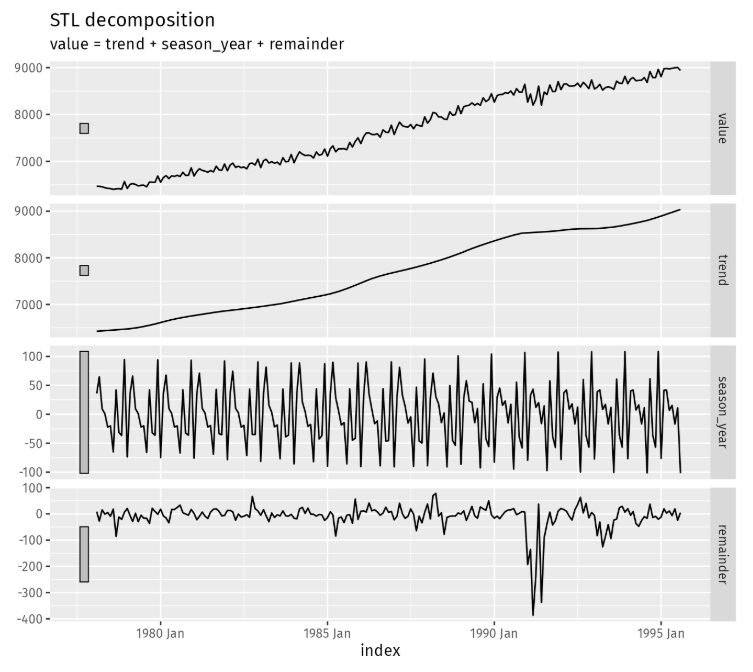
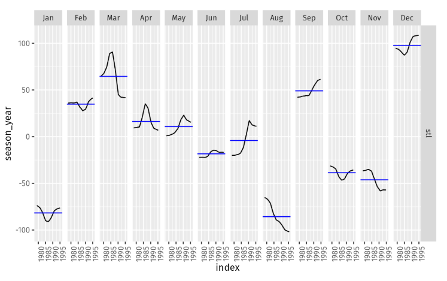

```{r setup, include=FALSE}
knitr::opts_chunk$set(echo = TRUE)
# install.packages("fpp3")
library(dplyr)
library(fpp3)

```
## 1) Consider the GDP information in global_economy. Plot the GDP per capita for each country over time. Which country has the highest GDP per capita? How has this changed over time?

### Question 1 Answers:

The country with the highest GDP per capita is Monaco. This has remained true for some time, with the country havign the highest by far up until what seems to be around 2008. After 2008, the country had a sharp downturn where the second place contender - Liechtenstein - was very close behind, if not at the same level at times. 

```{r q1}
# ?global_economy

 ## Too many subplots switching to ggplot
global_economy$gdp_per_cap <- as.numeric(global_economy$GDP)/as.numeric(global_economy$Population)
global_economy

## Need to set the legend to none b/c of the amount of countries. 
ggplot(global_economy, aes(x = Year, y = gdp_per_cap, color = Country)) +
  geom_line()+
  theme(legend.position='none')
 
### After viewing the chart pulling the distinct countries with any value higher than 100,000 to replot neater.
limited_countries <- global_economy |> filter(gdp_per_cap>=100000) |> select('Country')
limited_countries <- unique(limited_countries$Country)

## Filtering the df for new viz
lim_global_economy <- global_economy |> filter(Country %in% limited_countries)

# New limited Viz
ggplot(lim_global_economy, aes(x = Year, y = gdp_per_cap, color = as.factor(Country))) +
  geom_line() +
  labs(title = "GDP Per Capita Over Time", y = "GDP Per Capita", x = "Year")

```


## 2) For each of the following series, make a graph of the data. If transforming seems appropriate, do so and describe the effect.

 a- United States GDP from global_economy.
 b- Slaughter of Victorian “Bulls, bullocks and steers” in aus_livestock.
 c- Victorian Electricity Demand from vic_elec.
 d- Gas production from aus_production.

### Question 2 Answers:
##### a- United States GDP from global_economy.
```{r q2a}
## United States GDP from global_economy

#limiting for the United States
us_econ<- global_economy |> filter(Country =='United States')

autoplot(us_econ, gdp_per_cap) +
  labs(title = "US GDP Per Capita Over Time", x = "Year", y = "GDP Per Capita") 

```
#### b- Slaughter of Victorian “Bulls, bullocks and steers” in aus_livestock.
```{r q2b}
## Slaughter of Victorian “Bulls, bullocks and steers” in aus_livestock.

#Checking the data. The Month is already formatted into proper data type 
head(aus_livestock)

# Limited to what we want to show 
lim_aus_livestock <-   aus_livestock |> 
  filter(Animal=="Bulls, bullocks and steers")|>
  summarise(Count = sum(Count)) 

## Plotting the new limited tsibble
autoplot(lim_aus_livestock, Count) +
labs(title = "Slaughter of Victorian Bulls, bullocks and steers", x = "Year", y = "Count of Slaughter")

## Still pretty noisey going to aggregate up to qtr. 
qtr_aus_livestock <- lim_aus_livestock  |>
  index_by(Quarter = yearquarter(Month)) |>
    summarize(Count = sum(Count))


## Plotting the qtr tsibble. Much smoother, and is more readable. 
autoplot(qtr_aus_livestock, Count) +
labs(title = "Slaughter of Victorian Bulls, bullocks and steers", x = "Year", y = "Count of Slaughter")


### Cehcking the Decomp. Trend Results just ot see. 
## The data seems fairly flat, as in the over all trend is subtle with smaller seasonal and cyclical-type variations. Going to use an STL transformation to take a look at the year to year trend with 5 qutrs. Making the trend window 5 in order to get just about a year, but maintain the derivative moving avg with a "middle" point.
qtr_aus_livestock |>
  model(
    STL(Count ~ trend(window = 5) +
                   season(window = "periodic"),
    robust = TRUE)) |>
  components() |>
  autoplot()

## After the above transformation and decomp, the chart shows that the trend is fairly flat with some larger variations mainly at the beginning of the timeline. The seasonal chart seems like a pretty consistent seasonal pattern. 

```
#### c- Victorian Electricity Demand from vic_elec.
``` {r q2c}
##Victorian Electricity Demand from vic_elec

#Taking a look; The time is 30 Min Increments.
head(vic_elec)

#initial Plot of the data
autoplot(vic_elec, Demand) +
  labs(title = "Victoria Electricity Demand Over Time", x = "Year", y = "Demand")

### Going to try an STL Transformation again here. The pattern in the data is pretty consistent with respect to the annual cyclical nature of the data. The overall trend of the data seems to be fairly linear, by this I mean the overall demand doesnt seem to be increasing or decreasing outside of the cycles. Using STL, the main goal is to apply lesser weights to the outliers seen in 2014 and 2013. 

## The Tsibble is pretty granular. Im going to aggregate a bit to get less subplots in the STL transformation charts. 
day_agg_vic_elec <-vic_elec |> 
  index_by(Date = as_date(Date)) |>
  summarize(Demand = mean(Demand))


# When averaging to the day level it seems to bee a bit clearer of a cycle trend.
autoplot(day_agg_vic_elec, Demand) +
  labs(title = "Victoria Electricity Demand Over Time", x = "Year", y = "Demand")


### Cehcking the Decomp. Trend Results just ot see. 
### Plotting with STL. Window is set to 31 days for roughly a month period. 
day_agg_vic_elec |>
  model(
    STL(Demand ~ trend(window = (31)) +
                   season(window = "periodic"),
    robust = TRUE)) |>
  components() |>
  autoplot()

### The overall trend, with a few excetions has remained flat from begining to end. There were variations, and what seems to be seasonal patters for each year in the data. powerusage is generally higher in the southern hemisphere's summer months.
```
#### d- Gas production from aus_production.
``` {r q2d}
# Gas production from aus_production.
# ?aus_production

## Plot shows the data definitely needs a transformation. The trend is increasing overall, or at least from the 1970s to the most recent data. The seasonal varations also seem to be getting more extreme as we move from left to right. 
autoplot(aus_production, Gas)+
  labs(title = "Gas Production Over Time", x = "Year", y = "Gas Production in Petajoules")

### using the BoxCox Method from the text book to find the ideal lambda transformation in order to transform.
lambda <- aus_production |>
  features(Gas, features = guerrero) |>
  pull(lambda_guerrero)

aus_production |>
  autoplot(box_cox(Gas, lambda))+
  labs(y = "",
       title = latex2exp::TeX(paste0(
         "Transformed Australian Gas Produciton in Petajoules $\\lambda$ = ",
         round(lambda,2))))
## This transformation smoothed out both the seasonal variations to make them more consistent and predictable, while also blunting the drastic increase in the linear model. The lamda found was .11, which is larger than a log but less than a Square Root Transformation. 

```

## 3) Why is a Box-Cox transformation unhelpful for the canadian_gas data?

### Question 3 Answers:
After the transformation, the chart looks extremely similar to the initial chart. The Box Cox isnt too helpful here, the lambda value is clost to .6, which is over .5 and closer to one. The closer to 1 that the lambda value gets the more minimal the transformation. Additionally, with the exception of the middle piece of the data where the seasonal variance seems to get more exaggerated, the begining and the ends of the data seem to have a fairly stable variance.
```{r q3}

# ?canadian_gas #Production Volume in billions of cubic metres
autoplot(canadian_gas, Volume)+
  labs(title = "Gas Volume Over Time", x = "Month", y = "Production Volume in billions of cubic metres")

## Applying BoxCox
lambda <- canadian_gas |>
  features(Volume, features = guerrero) |>
  pull(lambda_guerrero)

canadian_gas |>
  autoplot(box_cox(Volume, lambda))+
  labs(y = "",
       title = latex2exp::TeX(paste0(
         "Transformed Canadian Gas Production Volume with $\\lambda$ = ",
         round(lambda,2))))

```


## 4) What Box-Cox transformation would you select for your retail data (from Exercise 7 in Section 2.10)?

### Question 4 Answers:
The lambda value found for the this BoxCox transformation was .19, which is a little higher than a log transformation at 0. This lambda value leveled out the variance in the seasonality of the data by a lot.
```{r q4}
### Pulling in tsibble from #7 in 2.10:
# ?aus_retail #Retail turnover in $Million AUD

### Transforming, so I can just deal with Avg Turnover regardless of Geog. or Retail Type
aus_agg <- aus_retail |>
  summarize(Turnover = mean(Turnover))

#Taking a look at the data. Trend is in
autoplot(aus_agg,Turnover)+
  labs(title = "Turnover Over Time", x = "Month", y = "Retail turnover in $Million AUD")

## Applying BoxCox
lambda <- aus_agg |>
  features(Turnover, features = guerrero) |>
  pull(lambda_guerrero)

aus_agg |>
  autoplot(box_cox(Turnover, lambda))+
  labs(y = "",
       title = latex2exp::TeX(paste0(
         "Transformed Austrailian Retail Turnover(\\$AUD) $\\lambda$ = ",
         round(lambda,2))))


```

## 5) For the following series, find an appropriate Box-Cox transformation in order to stabilise the variance. Tobacco from aus_production, Economy class passengers between Melbourne and Sydney from ansett, and Pedestrian counts at Southern Cross Station from pedestrian.

### Question 5 Answers:
#### a) Tobacco from aus_production

The BOXCOX Transformation yeilded next to no transformation, as the lambda value is .93. A value of 1 would be no transformation. This seems to be such a high value because the variance is already fairly stable.
```{r q5a}
# Tobacco from aus_production
# ?aus_production 


#Taking a look at the data. Trend is in
autoplot(aus_production,Tobacco)+
  labs(title = "Tobacco Production Over Time", x = "Quarter", y = "Tobacco and cigarette production in tonnes")

## Applying BoxCox
lambda <- aus_production |>
  features(Tobacco, features = guerrero) |>
  pull(lambda_guerrero)

aus_production |>
  autoplot(box_cox(Tobacco, lambda))+
  labs(y = "",
       title = latex2exp::TeX(paste0(
         "Transformed Austrailian Tobacco Production $\\lambda$ = ",
         round(lambda,2))))


```

#### b) Economy class passengers between Melbourne and Sydney from ansett
The Boxcox returned a Lambda value of 2 means that the data was transformed via an exponential transformation in order to stablize the variance.
```{r q5b}
#Economy class passengers between Melbourne and Sydney from ansett

## Prepping the Tsibble for the plotting and transformations. 
limited_econ <- ansett |> 
  filter(Class=="Economy",
         Airports == "MEL-SYD") |>
  summarize(Passengers = sum(Passengers))

#Taking a look at the data. Trend is in
autoplot(limited_econ,Passengers)+
  labs(title = "Economy Class Flights Over Time", x = "Week", y = "Number of Passengers")

## Applying BoxCox
lambda <- limited_econ |>
  features(Passengers, features = guerrero) |>
  pull(lambda_guerrero)

#Plot
limited_econ |>
  autoplot(box_cox(Passengers, lambda))+
  labs(y = "",
       title = latex2exp::TeX(paste0(
         "Transformed Economy Class Flights Over Time $\\lambda$ = ",
         round(lambda,2))))

```

#### c) Pedestrian counts at Southern Cross Station from pedestrians
After aggregating up to the weekly level for counts of pedestrians, the BoxCox lambda transformation that works best for this data set is .11, which is a little more than a log transformation of the data.
```{r q5c}
# Pedestrian counts at Southern Cross Station from pedestrian

#First attempt at limiting
limited_pedestrian <- pedestrian |> 
  filter(Sensor == "Southern Cross Station")|>
  summarise(Count = sum(Count))

#Taking a look at the data. Trend is in
autoplot(limited_pedestrian,Count)+
  labs(title = "Hourly Pedestrian Counts Over Time", x = "Hour", y = "Number of Pedestrians")

## Too crowded, aggregating up to Month
limited_pedestrian <- pedestrian |> 
  filter(Sensor == "Southern Cross Station")|>
  index_by(Date= as_date(Date)) |>
  summarise(Count = sum(Count))
  
autoplot(limited_pedestrian,Count)+
  labs(title = "Pedestrian Counts Over Time", x = "Date", y = "Number of Pedestrians")


## Still too crowded, aggregating up to Week
limited_pedestrian <- pedestrian |> 
  filter(Sensor == "Southern Cross Station")|>
  index_by(Week= yearweek(Date)) |>
  summarise(Count = sum(Count))
  
autoplot(limited_pedestrian,Count)+
  labs(title = "Pedestrian Counts Over Time", x = "Week", y = "Number of Pedestrians")

## Applying BoxCox
lambda <- limited_pedestrian |>
  features(Count, features = guerrero) |>
  pull(lambda_guerrero)

limited_pedestrian |>
  autoplot(box_cox(Count, lambda))+
  labs(y = "",
       title = latex2exp::TeX(paste0(
         "Transformed Economy Class Flights Over Time $\\lambda$ = ",
         round(lambda,2))))

```

## 7) Consider the last five years of the Gas data from aus_production.

```{r q7_setup}
gas <- tail(aus_production, 5*4) |> select(Gas)
```

#### a) Plot the time series. Can you identify seasonal fluctuations and/or a trend-cycle?
The seasonal fluctuations in this timeseries show that the Gas production in Australia from 2005 through 2010 increases and peaks at the end of every Q2. The production then decreases from there to the end of the year. The seasonal patter continues year after year. The longer term trend within the data is a slow and steady increase year after year. In other words, the peaks are slightly higher with each consecutive year, just as the valleys are also relatively higher each year.
```{r q7a}
autoplot(gas, Gas)+
  labs(title = "Quarterly Gas Production Australia",
  x="Quarter",
  y="Gas Produced")


```

#### b) Use classical_decomposition with type=multiplicative to calculate the trend-cycle and seasonal indices.
As said before the trend is a slow and steady increase over time. Similarly, the seasonal trend, now parsed out of the initial time series, increases to peak towards the end of Q2 and then declines until the beginning of Q1 in the following year. 
```{r q7b}

gas |>
  model(
    classical_decomposition(Gas, type = "multiplicative")
  ) |>
  components() |>
  autoplot() +
  labs(title = "Classical Mult. decomposition of Gas Production Australia")
```

#### c) Do the results support the graphical interpretation from part a?
Yes, as i've outlined above both of the parsed out trend and seasonality charts align which my initial interpretation of the trends and seasonal patterns

#### d) Compute and plot the seasonally adjusted data.
```{r q7d}
### Doing an STL Decomposition 
gas |>
  model(
    STL(Gas ~ trend(window = (7)) +
                   season(window = "periodic"),
    robust = TRUE)) |>
  components() |>
  autoplot()

```

#### e) Change one observation to be an outlier (e.g., add 300 to one observation), and recompute the seasonally adjusted data. What is the effect of the outlier?
The impact of the one edited outlier shifts the main chart as well as the remainder chart. This makes sense, as the trend plot along with the seasonal adjustment plot should be unaffected by this outlier. The remainder, which is where the seasonality and the trend are removed from the chart shoudl be the only chart showing the outlier. 

```{r q7e}

#Edited Gas1
altered_g <-gas

## Selecting Where im updating the number   
altered_g |> filter(Quarter == yearquarter('2008 Q2'))

altered_g <- altered_g |> mutate(Gas = ifelse(Quarter == yearquarter("2008 Q2"), Gas+300, Gas))


## Checking
altered_g |> filter(Quarter == yearquarter('2008 Q2'))

#plotting the new altered 
altered_g |>
  model(
    STL(Gas ~ trend(window = (7)) +
                   season(window = "periodic"),
    robust = TRUE)) |>
  components() |>
  autoplot()

```

#### f) Does it make any difference if the outlier is near the end rather than in the middle of the time series?
In the plot above i placed the outlier in the middle of the time series. This time the edited outlier was placed towards the end of the time series. Overall, when the edited outlier is at the end of the timeseries, as expected the main edited plot has shows the outlier, as does the remainder plot. However, i dont see any other drastic changes in the data. 
```{r q7f}

#Edited Gas2
altered_g2 <-gas

## Selecting Where im updating the number   
altered_g2 |> filter(Quarter == yearquarter('2010 Q1'))

altered_g2 <- altered_g2 |> mutate(Gas = ifelse(Quarter == yearquarter("2010 Q1"), Gas+300, Gas))


## Cehcking
altered_g2 |> filter(Quarter == yearquarter('2010 Q1'))

#plotting the new altered 
altered_g2 |>
  model(
    STL(Gas ~ trend(window = (7)) +
                   season(window = "periodic"),
    robust = TRUE)) |>
  components() |>
  autoplot()

```

## 8) Recall your retail time series data (from Exercise 7 in Section 2.10). Decompose the series using X-11. Does it reveal any outliers, or unusual features that you had not noticed previously?
In the remainder subplot there is an outlier that i did not see before, but see now with the X11 decomposition. There is a super high turnover value in the year 2000. 
```{r q8}

## Agg code from before
aus_agg <- aus_retail |>
  summarize(Turnover = mean(Turnover))

# Plotting Original 
autoplot(aus_agg,Turnover)+
  labs(title = "Turnover Over Time", x = "Month", y = "Retail turnover in $Million AUD")

## X11 Decomp
aus_retail_x11 <- aus_agg |>
  model(x11 = X_13ARIMA_SEATS(Turnover ~ x11())) |>
  components()

# Plotting X11
 autoplot(aus_retail_x11,Turnover)+
   labs(title = "Turnover Over Time", x = "Month", y = "Retail turnover in $Million AUD")

```

## 9) Figures 3.19 and 3.20 show the result of decomposing the number of persons in the civilian labour force in Australia each month from February 1978 to August 1995.

#### Figure 3.19: Decomposition of the number of persons in the civilian labour force in Australia each month from February 1978 to August 1995.

#### Figure 3.20: Seasonal component from the decomposition shown in the previous figure.


#### a) Write about 3–5 sentences describing the results of the decomposition. Pay particular attention to the scales of the graphs in making your interpretation.
Firstly, overall the the main plot of the civilian labor force of Australia has been trending upward for the years shown, which is 1978 through 1995. It's safe to say the Australian Civilian labor force grew during that time. However,I did not control for population changes, so these numbers are absolute and not relative to the larger population. In addition to that there is a decrease in the number of civilian employment numbers around 1991/1992. It can be seen most drastically in the remainder subplot, particularly towards the end of 1991.Lastly, the plots show that December and March are the two portions of the year that the seasonal patterns dictate that the workforce is the largest. January and August are the months that have consisistently had the lowest employment numbers.


#### b) Is the recession of 1991/1992 visible in the estimated components?

The recession of 1991/1992 is most definitely visible. Particularly it is most visible in the August portion of the Seasonal Component chart and in the remainder portion of the Decomposition plot towards the latter portion of 1991. These areas have the lowest drops in the civilian labor force numbers on the whole chart.


